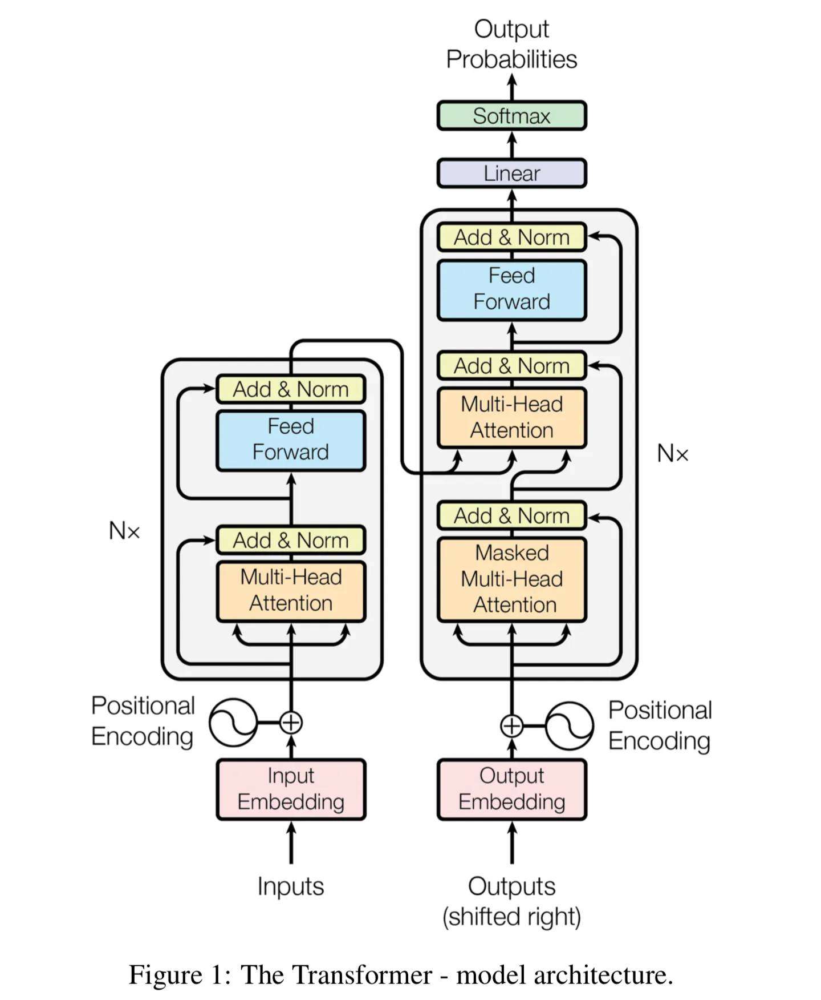

# LLM

## Concepts

### Papers

- [Attention Is All You Need](https://arxiv.org/abs/1706.03762)
- 

### Use Cases

- chatbots
- write an essay based
- summarize a conversations
- translation
- natural language to machine code
- entity recognition
- word classification
- augmenting 

### Transformer

- Context
- Self-attention

## TBD

- RNN - Recurrent Neural Networks

## References

- https://neo4j.com/
- https://www.tutorialspoint.com/neo4j/index.htm

